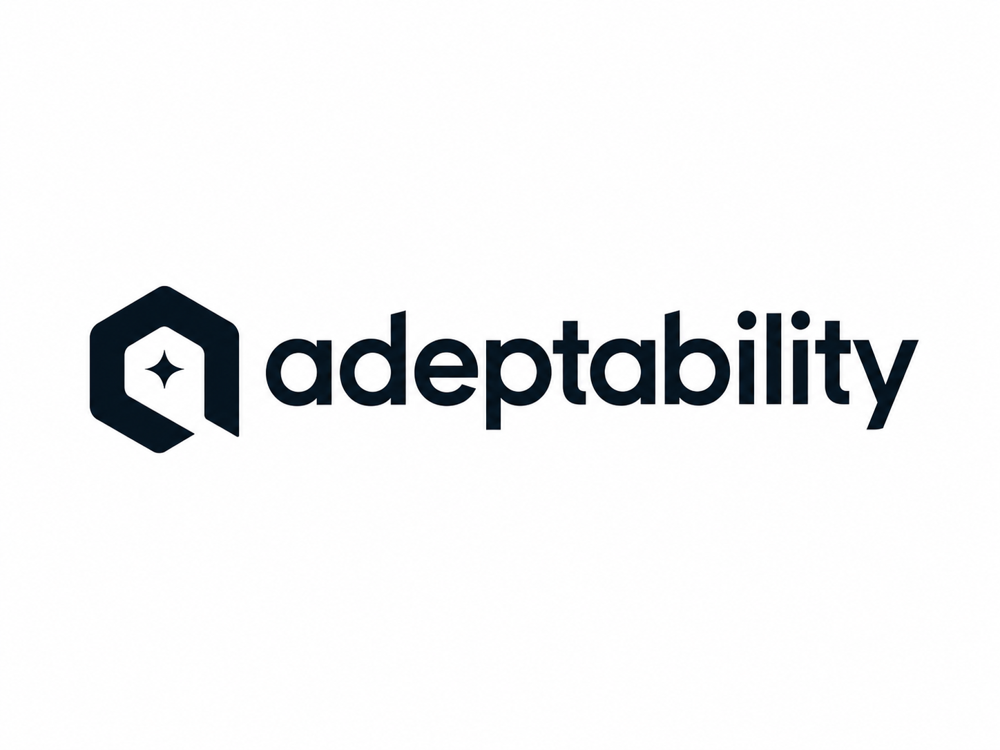

<p align="center">
  
</p>

<h1 align="center">write an AI skill once, run it in every coding agent</h1>

<p align="center">
  <a href="https://github.com/itaywol/adeptability/releases/latest"></a>
  <a href="https://github.com/itaywol/adeptability/actions/workflows/ci.yml"></a>
  <a href="https://pkg.go.dev/github.com/itaywol/adeptability"></a>
  <a href="https://goreportcard.com/report/github.com/itaywol/adeptability"></a>
  <a href="./LICENSE"></a>
</p>

`adept` is a small CLI that lets you author an AI agent skill (a prompt, rule, or
procedure) **once**, then sync it accurately into Claude Code, Cursor, GitHub Copilot,
OpenAI Codex, OpenCode, and 45+ other AI coding agents. It handles the per-harness
frontmatter, activation rules, aggregation, and size budgets so you don't have to.

Think of it as **dotfiles for your AI coding agents**: one source of truth, the right
on-disk format everywhere.

- **One library, every format.** No copy-pasting incompatible frontmatter into five paths.
- **Safe installs.** A static + optional-LLM scanner checks skills from `skills.sh` / GitHub before they land; critical findings block by default.
- **Drift-proof.** Edit a skill in any harness, pull it back to canonical, re-publish; a 3-way detector flags divergence.
- **Signed & reproducible.** Content-hashed skills, pinned upstream provenance, cosign-signed binaries.

## Install

```bash
# Go (any platform)
go install github.com/itaywol/adeptability/cmd/adept@latest

# macOS / Linux (Homebrew)
brew install itaywol/tap/adeptability

# Any platform (curl)
curl -fsSL https://raw.githubusercontent.com/itaywol/adeptability/main/scripts/install.sh | sh

# Containers
docker run --rm -v "$PWD:/work" -w /work ghcr.io/itaywol/adeptability:latest --help
```

Or download a pre-built, cosign-signed binary from the
[latest release](https://github.com/itaywol/adeptability/releases/latest).

## Quick start

```bash
cd ./my-project
adept init                         # new project, or auto-adopt existing .claude/ .cursor/ AGENTS.md; seeds the default skills
adept skill add lint-style --edit  # scaffold a skill, opens $EDITOR
adept harness add claude-code
adept harness add cursor
adept sync                         # render the skill into every enabled harness
```

That's the whole loop: author in one place, `adept sync`, and each agent gets its own
correct format. Edit a skill inside a harness instead? `adept sync-from` pulls it back to
canonical, then `adept sync` re-publishes everywhere.

`adept init` also seeds three bundled default skills so a fresh project is useful on day one:
`using-adept` (drive the CLI), `authoring-adept-skills` (write a good, portable skill), and
`adept-self-improve` (capture a session lesson as a skill, then sync it everywhere). They're
ordinary project skills: edit, replace, or `adept skill remove` them. Skip with
`adept init --no-default-skills`.

## How it works

Every agent loads skills from a different path with a different schema: `.claude/skills/<id>/SKILL.md`,
`.cursor/rules/<id>.mdc`, `.github/instructions/*.instructions.md`, a single `AGENTS.md` for Codex,
and so on. Keeping the same knowledge consistent across them by hand drifts fast.

`adept` keeps **one canonical skill** and renders it per harness:

- **Library:** reusable skills you clone and stack (`$HOME/.adeptability` by default).
- **Project:** `<project>/.adeptability/skills/<id>/`, resolved over your libraries (project wins).
- **Sync:** renderers translate canonical → harness bytes; a hash-based state machine
  (`synced | ahead | behind | diverged`) drives `status` and `diff`. No lockfile.

> [!TIP]
> See [AGENTS.md](./AGENTS.md) for the resolution model, drift detector, and architecture in depth.

## Commands

Five verbs and three subcommand groups cover everything:

```
adept init      [--from <url>] [--ref <branch>] [--mode symlink|copy]
adept status
adept sync      [--harness <id>] [--dry-run]
adept sync-from [--harness <id>] [--all] [--dry-run]
adept diff      [--harness <id>]

adept harness  add <id> | remove <id> | list
adept skill    add <id> [--edit] | install <owner>/<repo>[#ref]/<skill> | update [<id>]
               | info <slug> | search <query> | check <target> | edit <id> | remove <id> | list
adept library  add <name> --from <url> | remove <name> | list
adept config   list | get/set/unset <key> | llm set <provider> | llm test
```

Common config keys: `mode` (`symlink`|`copy`), `scan.onInstall`, `scan.blockSeverity`,
`llm.provider` (`anthropic`|`ollama`). API keys come from the environment
(`ANTHROPIC_API_KEY`) at call time, never stored in config.

Shell completion ships via cobra: `adept completion zsh > "${fpath[1]}/_adept"` (or bash/fish).

## Installing skills from the ecosystem

```bash
adept skill search find-skills                      # query skills.sh
adept skill info    vercel-labs/skills/find-skills  # repo, stars, license, SHA, installs
adept skill install vercel-labs/skills/find-skills  # preview + scan + Y/n
adept skill update                                  # bump every locked external skill
```

Each install pins the upstream provenance (repo, ref, SHA, content hash) and runs a safety
scan first. The scanner mirrors [getsentry/skill-scanner](https://github.com/getsentry/skills)
categories (prompt-injection, malicious-code, secret-exposure, supply-chain, …); **critical
findings hard-block** unless you pass `--allow-unsafe`. Configure an LLM provider to add an
intent pass on top of the static checks:

```bash
export ANTHROPIC_API_KEY=sk-...
adept config llm set anthropic
adept skill check vercel-labs/skills/find-skills    # static + LLM merged report
```

## Skill format

A skill is a directory with one `SKILL.md` (YAML frontmatter + body) plus any sidecars
(`scripts/`, `references/`, `assets/`).

```markdown
---
id: pr-review
description: Use before opening a PR. Tests, security, performance.
activation: agent              # always | globs | agent | manual
allowed-tools: [Read, Grep]    # carried into Claude
tags: [review, quality]
---
# PR Review Checklist

- [ ] Tests added or updated
- [ ] No secrets in diff
- [ ] Public API changes documented
```

The schema lives at `pkg/adeptschema/skill.schema.json` and is validated on every load.

## Harness support

Five harnesses ship specialized renderers with sidecar handling, glob translation, and size budgets:

| Harness | Output | Notes |
|---|---|---|
| Claude Code | `.claude/skills/<id>/SKILL.md` | full sidecars; `allowed-tools` carried |
| Cursor | `.cursor/rules/<id>.mdc` | `always`/`globs`/`agent` → `alwaysApply`/`globs`/`description` |
| OpenCode | `.opencode/skill/<id>/SKILL.md` | full sidecars |
| Codex | `AGENTS.md` | aggregated, 32 KiB cap, lowest-priority dropped first |
| GitHub Copilot | `.github/instructions/<bucket>.instructions.md` | aggregated per-glob |

Every agent in the [vercel-labs/skills matrix](https://github.com/vercel-labs/skills#supported-agents)
(Windsurf, Gemini CLI, Cline, Continue, Roo, Goose, and 40+ more) works out of the box via a
generic adapter. Run `adept harness list` for the live registry, or drop a YAML adapter file in
`$ADEPT_LIBRARY/libs/<name>/adapters/` to add one without recompiling.

## Development

```bash
git clone https://github.com/itaywol/adeptability
cd adeptability
go build ./...
go test -race ./...
```
