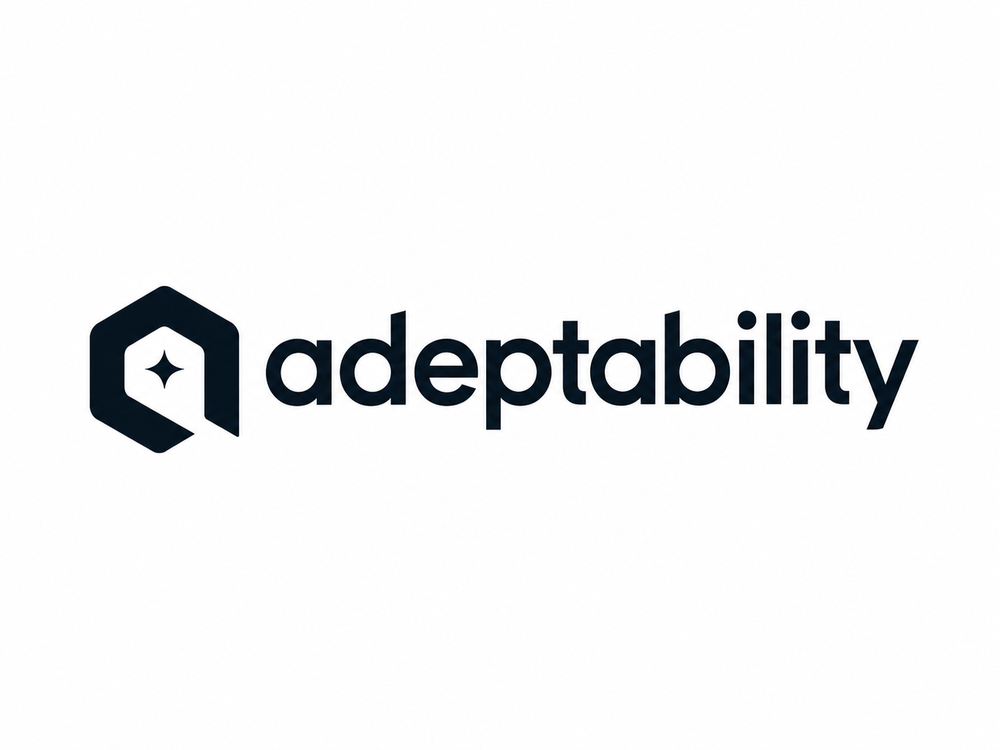
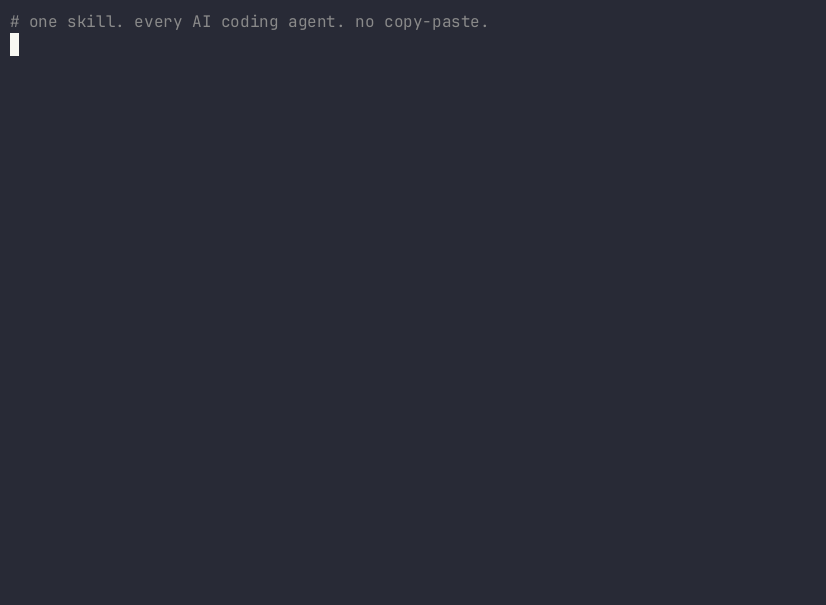

<p align="center">
  
</p>

<h1 align="center">write an AI skill once, run it in every coding agent</h1>

<p align="center">
  <a href="https://github.com/itaywol/adeptability/releases/latest"></a>
  <a href="https://github.com/itaywol/adeptability/actions/workflows/ci.yml"></a>
  <a href="https://pkg.go.dev/github.com/itaywol/adeptability"></a>
  <a href="https://goreportcard.com/report/github.com/itaywol/adeptability"></a>
  <a href="./LICENSE"></a>
</p>

<p align="center"><a href="https://adeptability.itaywol.tools"><b>adeptability.itaywol.tools</b></a></p>

<p align="center">
  
</p>

`adept` lets you author an AI coding skill (a prompt, rule, or procedure) — or a **subagent**
(a reviewer, test-runner, or other specialist) — **once**, then render it accurately into
Claude Code, Cursor, GitHub Copilot, OpenAI Codex, OpenCode, and 50+ other agents. It handles
each harness's frontmatter, activation rules, aggregation, and size budgets for you — think
**dotfiles for your AI coding agents**: one source of truth, the right on-disk format
everywhere.

📖 **[Full documentation → adeptability.itaywol.tools](https://adeptability.itaywol.tools)**

## Install

```bash
# Go (any platform)
go install github.com/itaywol/adeptability/cmd/adept@latest

# macOS / Linux (Homebrew)
brew install itaywol/tap/adeptability

# Any platform (curl installer)
curl -fsSL https://raw.githubusercontent.com/itaywol/adeptability/main/scripts/install.sh | sh

# Nix / NixOS (flake)
nix profile install github:itaywol/adeptability

# Containers
docker run --rm -v "$PWD:/work" -w /work ghcr.io/itaywol/adeptability:latest --help
```

Or grab a pre-built, cosign-signed binary from the
[latest release](https://github.com/itaywol/adeptability/releases/latest).

## 60-second quickstart

```bash
cd ./my-project
adept init                          # scaffold .adeptability/, adopt any existing .claude/ .cursor/ AGENTS.md, seed default skills
adept skill add lint-style --edit   # scaffold a canonical skill, opens $EDITOR
adept agent add pr-reviewer --template evaluator   # scaffold a subagent (then `adept agent check` lints it)
adept harness add claude-code       # enable a harness (run `adept harness list` for all ids)
adept harness add cursor
adept sync                          # render skills + agents into every enabled harness
adept status                        # init state, libraries, harnesses, and drift at a glance
```

`adept sync` writes `.claude/skills/lint-style/SKILL.md`, `.cursor/rules/lint-style.mdc`,
`.claude/agents/pr-reviewer.md`, and so on — each in that harness's native format. Edit one
inside a harness instead? Run `adept sync-from` to pull it back to canonical, then
`adept sync` to re-publish everywhere. Building scheduled automation? `adept loop add`
composes a discovery skill + evaluator agent + cron skeleton in one shot — see the
[loops guide](https://adeptability.itaywol.tools/docs/guides/loops/).

`init` also seeds bundled default skills (`using-adept`, `authoring-adept-skills`,
`authoring-adept-agents`, `authoring-adept-loops`, `adept-self-improve`) so a fresh project is
useful on day one. Skip with `--no-default-skills`.

### Global skills

Prefix any command with `--global` to target your home directory instead of a project — for
skills you want everywhere without an `adept init` per repo. Supported by `claude-code`,
`codex`, and `opencode` (not Cursor or Copilot). See
[Scopes](https://adeptability.itaywol.tools/docs/concepts/scopes/).

```bash
adept --global harness add claude-code && adept --global skill add lint-style --edit && adept --global sync
```

## Core concepts

- **Canonical skill** — one `SKILL.md` (YAML frontmatter + markdown body) plus optional
  `scripts/`, `references/`, `assets/` sidecars. The single source of truth for a skill.
- **Canonical agent** — one `.adeptability/agents/<id>.md` (frontmatter + system prompt)
  rendered to `.claude/agents/`, `.opencode/agents/`, `.cursor/agents/`, `.github/agents/`,
  and `.codex/agents/*.toml`. `adept agent check` runs a safety scan plus a best-practice
  lint. See [Canonical agents](https://adeptability.itaywol.tools/docs/concepts/agents/).
- **Harness** — a target AI agent (Claude Code, Cursor, Codex, …). `adept sync` renders each
  canonical skill into every enabled harness's own path and schema; a hash-based state
  machine (`synced | ahead | behind | diverged`) powers `status` and `diff`. No lockfile.
- **Library** — a shared, versioned set of skills, resolved package-manager style. Your
  project commits only a *reference* (`{name, remote, ref}`); the skills themselves clone into
  `.adeptability/libs/<name>/` (gitignored), falling back to the machine store
  (`$ADEPT_LIBRARY`, default `~/.adeptability`) when no project-local clone exists yet.
  Teammates clone your repo, run `adept`, and the library resolves into their project and
  materializes into their harnesses.

Read the [Concepts guide](https://adeptability.itaywol.tools/docs/concepts/libraries/) for the
library model, the consumer-vs-library layouts, and the 3-way drift machine.

## Supported harnesses

Five harnesses ship **specialized renderers** (correct frontmatter, activation translation,
sidecar handling, size budgets): **Claude Code**, **Cursor**, **OpenCode**, **Codex**
(`AGENTS.md`, aggregated, 32 KiB cap), and **GitHub Copilot** (`.github/instructions/`,
bucketed per-glob).

50+ more agents (Windsurf, Gemini CLI, Cline, Continue, Roo, Goose, Junie, …) work out of the
box via a generic per-skill adapter. Run `adept harness list` for the live registry, or drop a
YAML adapter into `$ADEPT_LIBRARY/adapters/` to add one without recompiling. See the
[Harness Comparison](https://adeptability.itaywol.tools/docs/harness-comparison/) for exactly
what each renderer emits and why.

## Docs & contributing

- **[Documentation site](https://adeptability.itaywol.tools)** — getting started, concepts,
  guides, full command reference, and the harness comparison.
- **[CONTRIBUTING.md](./CONTRIBUTING.md)** — build, test, and PR gates.
- **[AGENTS.md](./AGENTS.md)** — architecture, resolution model, and invariants for agents
  working in this repo.

MIT © [itaywol](https://github.com/itaywol)
